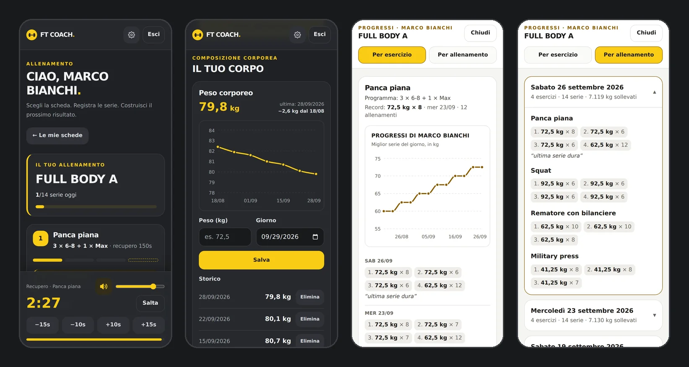
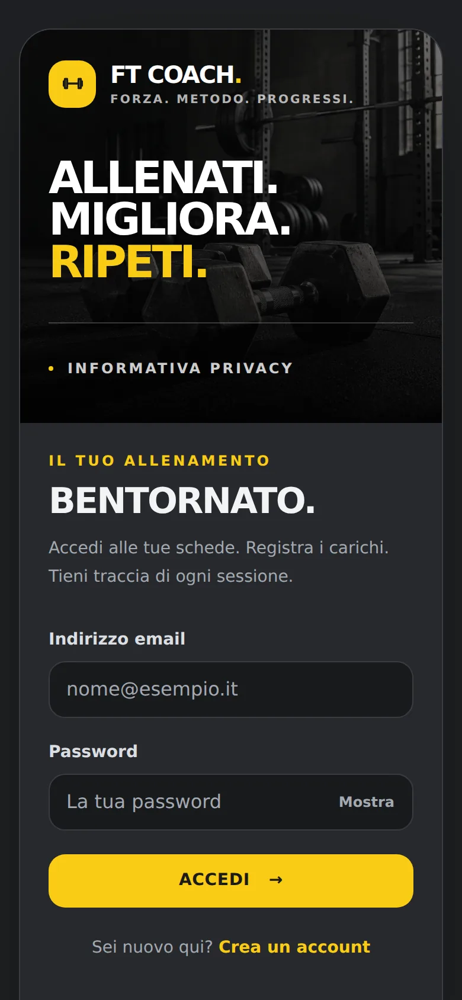
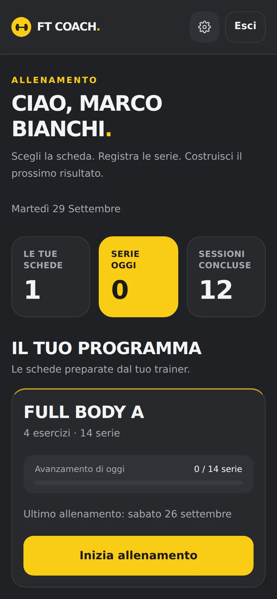
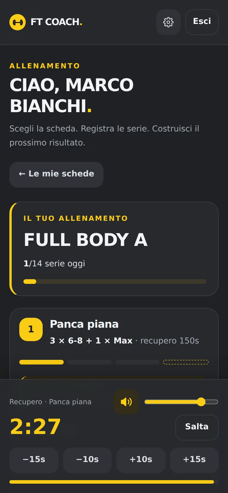
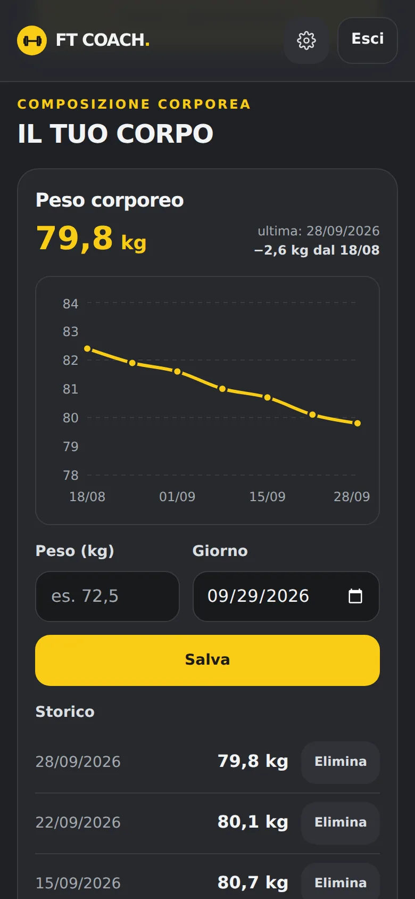
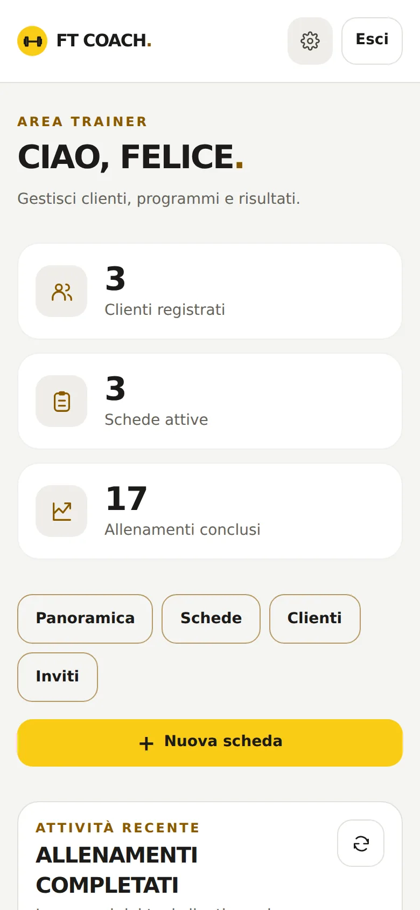
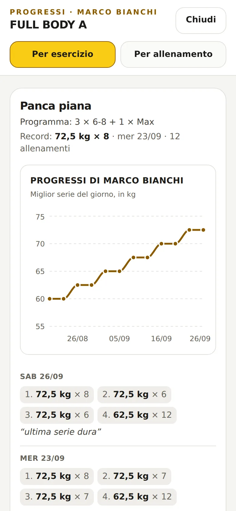
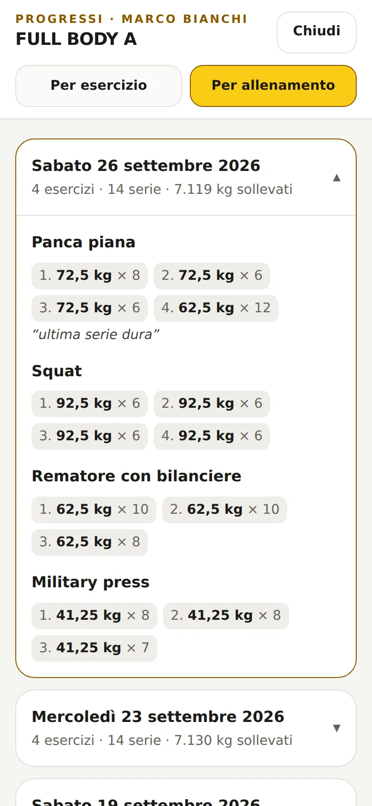
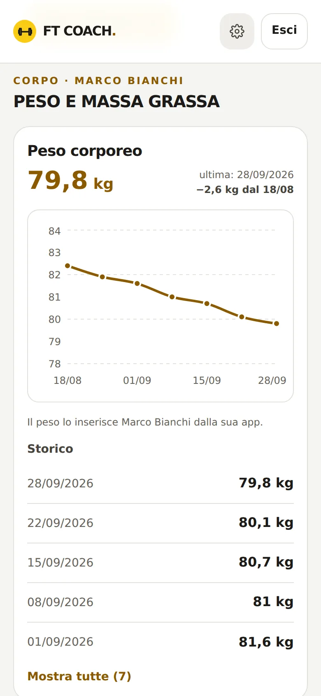

# FT Coach — Frontend

[](https://github.com/Felice556/ft-coach-frontend/actions/workflows/test.yml)

**A mobile-first web app for personal trainers and their clients.**
The trainer builds training plans, clients log every set from their phone at the gym, and both follow the progress with charts.

I'm a personal trainer and a junior developer: I built FT Coach for my own coaching work, and it's used by my real clients.

🔗 **[Live app](https://ft-coach.pages.dev)** · **[Backend repo](https://github.com/Felice556/ft-coach-backend)**

> Sign-up is invite-only (clients join with a code from their trainer), so the screenshots below show the app with demo data.



---

## ✨ Features

### For clients
- **Workout mode** — one card per exercise with weight/reps steppers, the target of the next set (rep ranges like `6-8`, "Max reps", drop sets) and what was lifted last time
- **Rest timer** — starts automatically after each set, `−15s / −10s / +10s / +15s`, countdown beeps, mute button and volume slider, keeps the screen awake so the sound always plays
- **Progress charts** — best set of each day for every exercise
- **Body weight tracking** — log your weight with a chart and the change since the first entry; see the body-fat % measured by the trainer
- **Notes for the trainer** on any set (e.g. "shoulder pain")
- **Supersets and jumpsets** — linked exercises are grouped (A1, A2…): in a superset the app moves you straight to the next exercise, in a jumpset it starts the rest in between and tells you what comes next
- **End-of-workout feedback** — an effort score from 1 to 10 and a note for the trainer

### For the trainer
- **Plan editor** — sets, rep ranges, rest, notes, video links, extra sets with their own reps/rest; reusable exercise and note libraries; link exercises into **supersets, jumpsets or trisets** (sets and reps can differ)
- **Client feedback** — effort score and notes after every workout, with an effort chart over time
- **Client history** — tap a plan or a completed workout to see every set the client logged, *per exercise* (with charts) or *per workout* (day by day)
- **Body composition** — log clients' body-fat % and see their body weight, both charted
- **Invites** — single-use, expiring codes shared via WhatsApp/SMS with a pre-filled sign-up link
- **Account management** — change a client's email or set a temporary password without ever seeing their password
- **Nothing gets lost** — plans and exercises are archived, not deleted, so the history is always kept

### Everywhere
- 📱 Installable **PWA**, designed for one-hand use at the gym (big touch targets, sticky timer, safe areas on iPhone)
- 🌗 **Light / dark / automatic theme**, applied before the first paint (no flash)
- 🔒 **Sessions that renew themselves**: active users never have to log in again, but a password change logs out every device
- 🇪🇺 **Privacy**: GDPR notice and explicit consent for health data at sign-up

---

## 📸 Screenshots

| Login | Client home | Workout + rest timer | Body weight |
|:---:|:---:|:---:|:---:|
|  |  |  |  |

| Trainer dashboard | History per exercise | History per workout | Body composition |
|:---:|:---:|:---:|:---:|
|  |  |  |  |

---

## 🛠️ Tech stack

| | |
|---|---|
| **UI** | React 18, TypeScript |
| **Styling** | Tailwind CSS v4 with design tokens (CSS variables) for the light/dark themes |
| **Charts** | Recharts, colors read from the active theme |
| **Build** | Vite |
| **Browser APIs** | Web Audio API (timer sounds, no audio files), Screen Wake Lock API, Web Share API, Clipboard API |
| **Hosting** | Cloudflare Pages, with security headers (CSP, HSTS, X-Frame-Options…) in `public/_headers` |

## 🧠 Some choices I'm happy with

- **The rest timer stores the end time, not the seconds left**: if the phone throttles the page, the countdown is still right.
- **Nothing typed is lost when the session expires**: instead of reloading the page, a small login appears on top of it, and after signing in the half-filled form is still there.
- **Numbers the Italian way**: `72,5` and `72.5` are both accepted, because phone keyboards in Italy type a comma.
- **Accessible components**: labelled inputs, `aria-pressed` / `aria-expanded` states, focus trap in modals, `Esc` to close.

## ✅ Tests

Unit tests with **Vitest** (in a simulated browser with jsdom), run on every push with **GitHub Actions** together with the TypeScript check and the production build:

- **Set logic** — rep ranges typed by the trainer (`6-9`, `6/9`, `Max`), the order of normal and extra sets
- **Supersets and jumpsets** — groups (A1, A2…), which exercise comes next and how long to rest, skipping an exercise that has finished its sets
- **Numbers and dates** — `72,5` and `72.5` both accepted, dates that don't shift with the time zone
- **Timer sound settings** — mute and volume saved on the phone, volume always between 0 and 100
- **API client** — token sent on every call, renewed token saved *only* if the user hasn't logged out in the meantime, expired session handled without reloading the page, readable error messages

The backend has its own API tests against a real database: see the [backend repo](https://github.com/Felice556/ft-coach-backend#-tests).

## 📂 Project structure

```
src/
├── App.tsx               # login / sign-up, header, settings, session handling
├── api.ts                # typed API client (fetch wrapper, token renewal, errors)
├── ClienteDashboard.tsx  # client: plans, workout mode, rest timer
├── TrainerDashboard.tsx  # trainer: plan editor, clients, completed workouts
├── StoricoCliente.tsx    # trainer: full history of a plan (per exercise / per workout)
├── MisureCorporee.tsx    # body weight and body-fat % with charts
├── FeedbackCliente.tsx   # end-of-workout feedback: effort score and notes
├── Inviti.tsx            # trainer: invite codes
├── ProgressoChart.tsx    # exercise progress chart
├── Privacy.tsx           # privacy notice
├── collegamenti.ts       # supersets / jumpsets: groups, next exercise, rest
├── misure-formati.ts     # numbers and dates for body measurements
├── serie.ts              # set / rep-range logic
├── suono.ts              # timer sounds, volume, wake lock
└── tema.ts               # light / dark theme
tests/                    # Vitest tests
```

## 🚀 Run it locally

You need the [backend](https://github.com/Felice556/ft-coach-backend) running first.

```bash
git clone https://github.com/Felice556/ft-coach-frontend.git
cd ft-coach-frontend
npm install
echo "VITE_API_URL=http://localhost:3001" > .env
npm run dev            # http://localhost:5173
npm run dev:telefono   # same, reachable from a phone on the same Wi-Fi
npm test               # run the tests
```

---

## 📄 License

Code shared for portfolio purposes. **© 2026 Felice Russo — All rights reserved**: not licensed for reuse. See [LICENSE](LICENSE).

---

Made by **Felice Russo** · [LinkedIn](https://www.linkedin.com/in/felice-russo-web1/)
